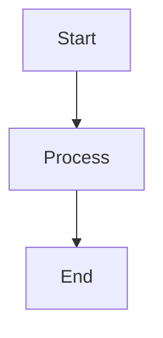

# CS50 Jekyll Theme Manual

This guide covers the CS50 Jekyll theme features, configuration options, and custom syntax.

---

## Configuration Options

Add these to your `_config.yml`:

```yaml
cs50:
  alert: warning dismissible
  description: "Your site description"
  locale: en
  title: "Site Title"
  tz: America/New_York
```

### Available Options

| Option | Description | Example |
|--------|-------------|---------|
| `alert` | Site-wide alert type | `warning`, `danger dismissible` |
| `description` | Meta description for SEO | `"Introduction to CS"` |
| `locale` | Language code | `en`, `fr`, `ar` |
| `title` | Site title | `"CS50"` |
| `tz` | Timezone | `Africa/Cairo` |

---

## Alerts

### Site-Wide Alert

1. Add to `_config.yml`:
```yaml
cs50:
  alert: warning dismissible
```

2. Create `_includes/alert.md`:
```markdown
**Important:** Course registration closes Friday!
```

### Alert Types

| Type | Color | Use Case |
|------|-------|----------|
| `primary` | Blue | General information |
| `secondary` | Gray | Secondary info |
| `success` | Green | Success messages |
| `danger` | Red | Critical warnings |
| `warning` | Yellow | Caution notices |
| `info` | Light blue | Tips/hints |
| `light` | Light gray | Subtle notices |
| `dark` | Dark gray | Dark themed |

Add `dismissible` to allow users to dismiss (remembered via localStorage).

### In-Page Alerts

Use Liquid tags within any page:

```liquid

This is a warning message!



**Critical:** Deadline approaching!



Congratulations! You completed the task.



**Tip:** Use `make` to compile your code.

```

---

## Includes

Place these files in `_includes/` folder:

| File | Location | Purpose |
|------|----------|---------|
| `header.md` | Top of sidebar | Site title and subtitle |
| `nav.md` | Middle of sidebar | Navigation links |
| `footer.md` | Bottom of sidebar | Copyright, links |
| `alert.md` | Top of every page | Alert content |

---

## Plugins (Liquid Tags)

### Time-Based Content

Show content **after** a specific date:
```liquid

The exam solutions are now available!

```

Show content **before** a specific date:
```liquid

The exam is coming soon!

```

### Spoiler (Collapsible Content)

```liquid

Try using a loop instead of recursion.

```

### Video Embed

```liquid

```

### Google Calendar

```liquid

```

### Local Time Display

Display times in user's local timezone:
```liquid

```

---

## Special Syntax

### MathJax (LaTeX Math)

Use `\\(...\\)` for inline math:
```markdown
The formula is \\(E = mc^2\\).
```

Use `\\[...\\]` for display math:
```markdown
\\[
\sum_{i=1}^{n} i = \frac{n(n+1)}{2}
\\]
```

### Mermaid Diagrams

````markdown

````

### Scratchblocks

````markdown
```scratch
when green flag clicked
say [Hello!] for (2) seconds
```
````

---

## Navigation Syntax

In `_includes/nav.md`:

```markdown
***                           <- Horizontal divider

* [Link Text](URL)            <- Regular link
* [**Bold Link**](URL)        <- Bold link (section header)
* [*Italic Link*](URL)        <- Italic link
    - [Subitem](URL)          <- Nested item
```

---

## Custom CSS

Create `assets/css/style.scss`:

```scss
---
---

// Your custom styles here
body {
  // Custom styles
}
```

---

## Useful Links

- [CS50 Theme Documentation](https://cs50.readthedocs.io/themes/jekyll/)
- [Jekyll Documentation](https://jekyllrb.com/docs/)
- [Kramdown Syntax](https://kramdown.gettalong.org/syntax.html)
- [MathJax Documentation](https://docs.mathjax.org/)
- [Mermaid Documentation](https://mermaid.js.org/)
